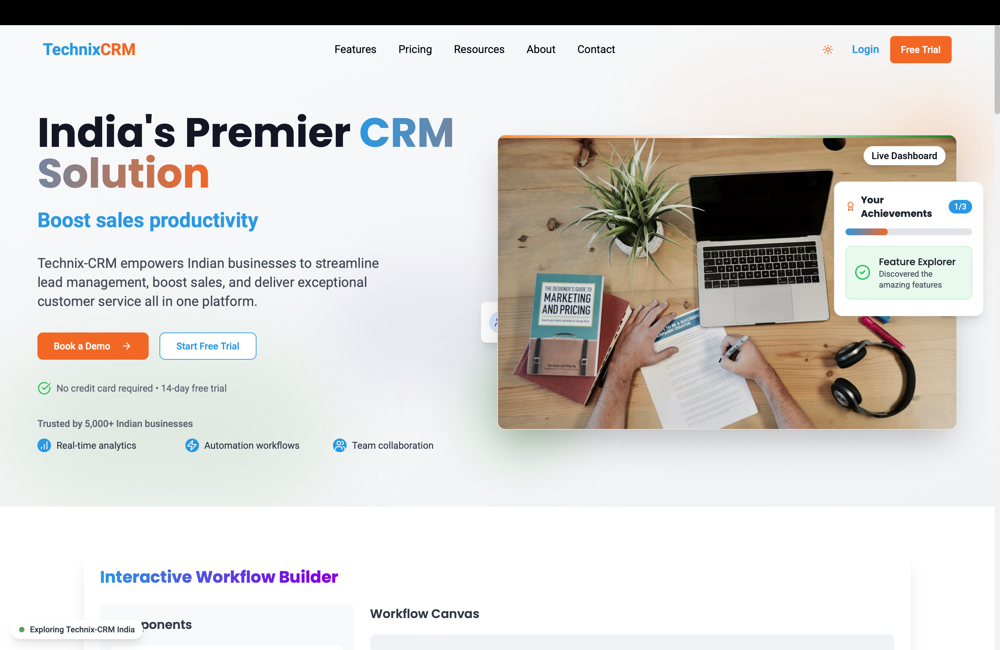
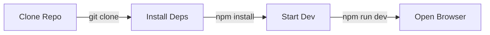

<div align="center">


# ⚡ Technix-CRM

<p align="center">
  
</p>

> **Transform your customer relationships with a visually stunning, AI-powered CRM platform designed for the next generation of Indian enterprises.**

<p align="center">
  <a href="https://reactjs.org/"></a>
  <a href="https://www.typescriptlang.org/"></a>
  <a href="https://tailwindcss.com/"></a>
  <a href="https://vitejs.dev/"></a>
  <a href="https://ui.shadcn.com/"></a>
</p>

<p align="center">
  
  
  
  
</p>

<p align="center">
  <a href="https://technix-crm.netlify.app"></a>
  <a href="https://docs.technix-crm.com"></a>
  <a href="https://github.com/abhi-1408-shek/Technix-CRM/issues"></a>
</p>

[Live Demo](https://technix-crm.netlify.app) · [Documentation](https://docs.technix-crm.com) · [Report Bug](https://github.com/abhi-1408-shek/Technix-CRM/issues)

---

## 🎯 Project Showcase

<div align="center">
  
</div>

<details>
<summary>🌈 View More Screenshots</summary>
<br>

| 📱 Mobile View | 🖥️ Dashboard | 📊 Analytics |
|:---:|:---:|:---:|
|  |  |  |

</details>

---

</div>


## 🛠️ Cutting-Edge Tech Stack

<table align="center">
<tr>
  <td align="center" width="96">
    
    <br>React 18
  </td>
  <td align="center" width="96">
    
    <br>TypeScript
  </td>
  <td align="center" width="96">
    
    <br>Tailwind
  </td>
  <td align="center" width="96">
    
    <br>shadcn/ui
  </td>
  <td align="center" width="96">
    
    <br>Vite
  </td>
</tr>
<tr>
  <td align="center" width="96">
    
    <br>Zustand
  </td>
  <td align="center" width="96">
    
    <br>Framer
  </td>
  <td align="center" width="96">
    
    <br>TanStack
  </td>
  <td align="center" width="96">
    
    <br>Recharts
  </td>
  <td align="center" width="96">
    
    <br>Jest
  </td>
</tr>
</table>

## ✨ Why Choose Technix-CRM?

<table>
<tr>
  <td>
    
    <br>
    Built with Vite & React 18 for instant load times
  </td>
  <td>
    
    <br>
    Beautiful dark/light mode with micro-interactions
  </td>
</tr>
<tr>
  <td>
    
    <br>
    Advanced analytics & predictive sales
  </td>
  <td>
    
    <br>
    Trigger-based actions & multi-step flows
  </td>
</tr>
<tr>
  <td>
    
    <br>
    Email, WhatsApp, SMS integration
  </td>
  <td>
    
    <br>
    Your data, always protected
  </td>
</tr>
</table>

## 🎨 Modern UI Features

- **Responsive Design:** Optimized for all devices
- **Dark Mode:** Built-in theme switching
- **Micro-interactions:** Rich animations and transitions
- **3D Elements:** WebAR product visualization
- **Interactive Features:** Drag-and-drop workflow builder

## 🚀 Quick Start

<details open>
<summary>🔧 Setup & Installation</summary>



1. **Clone & Navigate**
   ```bash
   git clone https://github.com/abhi-1408-shek/Technix-CRM.git && cd Technix-CRM
   ```

2. **Install Dependencies**
   ```bash
   npm install
   ```

3. **Start Development**
   ```bash
   npm run dev
   ```

4. **Open in Browser**
   ```
   🌐 http://localhost:5173
   ```

</details>

## 📱 Preview

<div align="center">
  
</div>

## 💫 Core Features

<table>
<tr>
  <td>
    <h3>📊 Lead Management</h3>
    <ul>
      <li>🔄 Visual Pipeline</li>
      <li>📈 Smart Scoring</li>
      <li>👥 Contact Hub</li>
      <li>⚡ Task Automation</li>
    </ul>
  </td>
  <td>
    <h3>📈 Sales Analytics</h3>
    <ul>
      <li>💰 Revenue Forecasting</li>
      <li>📊 Performance Metrics</li>
      <li>📑 Custom Reports</li>
      <li>🎯 Goal Tracking</li>
    </ul>
  </td>
</tr>
<tr>
  <td>
    <h3>🤖 AI Features</h3>
    <ul>
      <li>🎯 Smart Lead Scoring</li>
      <li>🔮 Predictive Analytics</li>
      <li>📱 Chatbot Integration</li>
      <li>📊 Sentiment Analysis</li>
    </ul>
  </td>
  <td>
    <h3>🔄 Automation</h3>
    <ul>
      <li>⚡ Workflow Builder</li>
      <li>📧 Email Campaigns</li>
      <li>📱 SMS Integration</li>
      <li>🔔 Smart Notifications</li>
    </ul>
  </td>
</tr>
</table>

<p align="center">
  
</p>

- **Workflow Automation**
  - Visual builder
  - Template library
  - Conditional logic
  - Multi-step workflows

- **Customer Engagement**
  - Email campaigns
  - Meeting scheduling
  - Communication history
  - Follow-up automation

## 💡 Future Enhancements(Probabaly after winning finals)

- [ ] AI-powered lead scoring
- [ ] Advanced analytics dashboard
- [ ] Mobile application
- [ ] Integration marketplace
- [ ] Custom workflow templates

## 🤝 Contributing

Contributions are welcome! Please read our [Contributing Guide](CONTRIBUTING.md) for details on our code of conduct and the process for submitting pull requests.

## 📄 License

This project is licensed under the MIT License - see the [LICENSE](LICENSE) file for details.

## 🌐 Links

- [Website](https://technix-crm.netlify.app)
- [Documentation](https://technix-crm.netlify.app/resources)
- [Blog](https://technix-crm.netlify.app/resources/blog)

## 💫 Support

<a href="https://buymeacoffee.com/abhigcet">
  
</a>

---

<div align="center">
  Made with ❤️ by <a href="https://github.com/abhi-1408-shek">Abhishek</a>
</div>

